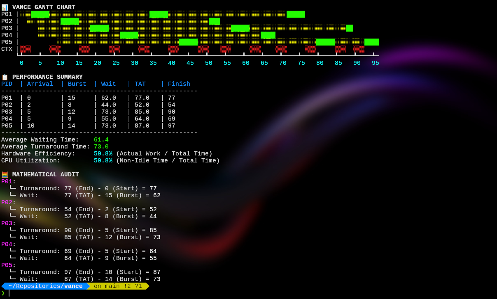

# **vance**

A modular Python package designed to simulate, trace, and visualize OS CPU scheduling algorithms.

Originally built to "scratch my own itch" type of package, but decided to include hardware representations for people like me who has the same itch, but require a more sophisticated experimentation.

---

## How to use?

Here's an example implementation of RR scheduling:

First, install the package:

```bash
pip install vance # If using pip
uv add vance      # vance natively uses uv!
```

```python
# Sample implementation using the RR scheduler
from vance import RR, SimulationEngine, Visualizer, Process

p = [
Process(pid=1, burst_time=15, arrival_time=0),
Process(pid=2, burst_time=8,  arrival_time=2),
Process(pid=3, burst_time=12,  arrival_time=5),
Process(pid=4, burst_time=9,  arrival_time=5),
Process(pid=5, burst_time=14,  arrival_time=10)
]

dispatch_latency = 3

engine = SimulationEngine(RR(time_quantum=5), dispatch_latency)
res = engine.run(p)

v = Visualizer()
v.render_gantt(res)
v.display_summary(res)
v.display_audit(res)
```

Sample Output:


### Creating a Custom Scheduler:

If you wish to create a custom scheduler, you can follow the blueprint below:

```python
from vance.policies import SchedulerPolicy

class MyCustomPolicy(SchedulerPolicy):
    def get_next_process(self, ready_queue, current_process, current_runtime, remaining_times):
        """
        The logic of your custom policy on deciding how to get the next process

        Args:
            ready_queue: A list of Process objects currently waiting for the CPU.
            current_process: The process currently occupying the CPU (if any).
            current_runtime: How many ticks the current process has been running without interruption (for RR quantums).
            remaining_times: A dictionary {pid: int} tracking exactly how much burst time is left for every process in the system. """

        pass

        # We recommend prefixing parameters with '_' if they are not used.
        # Here's an example implementation of FCFS and STCF

        # FCFS
        if current_process:
            return current_process
        if ready_queue:
            return ready_queue.pop(0)
        return None

        # STCF
        if not ready_queue and not current_process:
            return None
        best_in_queue = None
        if ready_queue:
            best_in_queue = min(ready_queue, key=lambda p: (remaining_times[p.pid], p.pid))
        if current_process:
            current_rem = remaining_times[current_process.pid]
            if best_in_queue and remaining_times[best_in_queue.pid] < current_rem:
                ready_queue.append(current_process)
                ready_queue.remove(best_in_queue)
                return best_in_queue
            return current_process
        ready_queue.remove(best_in_queue)
        return best_in_queue
```

### Accessing Raw Telemetry

If you want to perform custom analysis, you can access the data directly from the simulation results:

```python
# Simulation code here
...
# Accessing results for the first process
p1 = res["individual_results"][0]
print(f"P{p1['pid']} finished at {p1['completion']} with a TAT of {p1['turnaround']}")


avg = res["averages"]
print(f"System Efficiency: {avg['hardware_efficiency']}") # Work vs. Context Switch Overhead
print(f"CPU Utilization: {avg['cpu_utilization']}")      # Busy Time vs. Total Time

# Extract only context switch events
traces = res["structured_trace"]
for trace in traces:
    print(f"Time {trace.time}: {trace.event_type} for P{trace.pid}")

# The total CPU clock time that has been used
total_time = res["total_time"]
```

---

## Why do this?

During my OS class, we are tasked to perform simulations of CPU scheduling algorithms in Python, and since there are no Python packages (as far as I know) for CPU schedulers, I had to scour through the internet to look for sample implementations. I had to somehow refactor every algorithm that I need to fit my use case.

Because of this, it took me a few hours to perform the simulation. It could've been far more faster if there was a unified package. Our teacher could've provided a demonstration as well.

So I took the initiative in starting this project, and thought of it as my first ever open source project.

This project will also be a platform for me (I hope it does for you too), to practice my coding skills and strengthen my OS scheduling knowledge.
